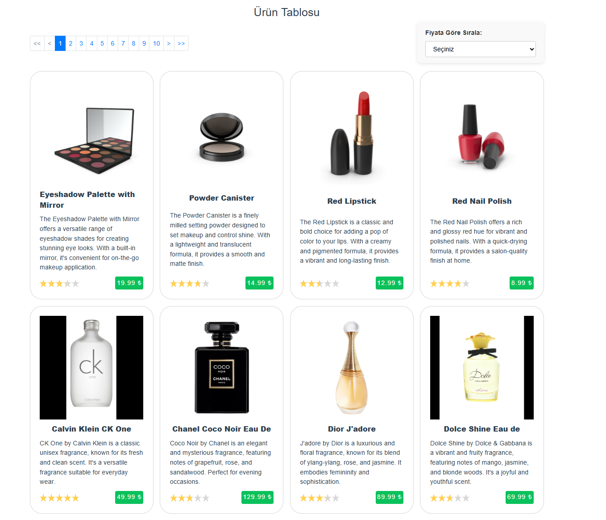
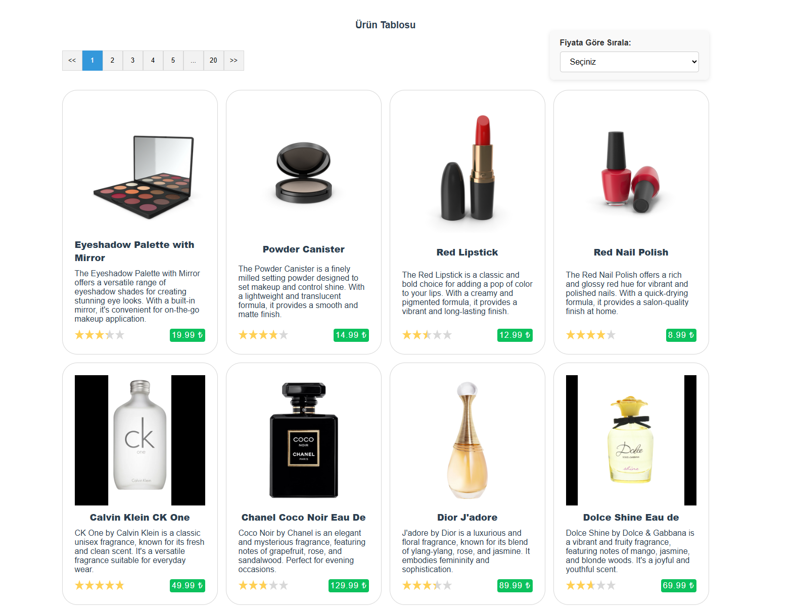

# Vue ile Dinamik Ürün Listesi ve Sayfalama

- Ürün listesini gösteren bir Vue bileşeni oluşturulmuştur.
- API’den ürünler sayfa bazlı olarak çekilmektedir.
- Ürünler, fiyata göre artan veya azalan şekilde sıralanabilmektedir.
- Proje **Vue 2 Options API** ile geliştirilmiş ve ardından **Vue 3 Composition API**'ye yükseltilmiştir.

## Proje Hakkında

- Projede **`vue2`** ve **`vue3`** olmak üzere iki branch bulunmaktadır.
- **`vue2`** branch'inde **Vue 2** geliştirmeleri yapılmıştır.
- **`vue3`** branch'inde ise **Vue 3** geliştirmeleri yapılmıştır.
- Vue 2'den Vue 3'e geçişte kullanılan paketler güncellenmiş ve uyumsuz olanlar değiştirilmiştir.
- Stil dosyaları SCSS mantığıyla oluşturulmuştur.
- Vue 2 geliştirmesinde state management olarak **Vuex store** kullanılmış, Vue 3'te ise **Pinia store** kullanılmıştır.

## Uygulamayı Çalıştırın
1-Projeyi klonlayın:
```
git clone https://github.com/emkc20/ticimax_production.git
```

2- İligli branch'e geçiş yapın:
```
git checkout vue2
``` 
veya
```
git checkout vue3
```

3- İlgili branch'lerin paketlerini yükleyin: 
```
yarn install
```

4- Branch'ler arası geçişte hata almamak için ``node_modules`` klasörünü silip tekrar yükleyin.

5- Projeyi çalıştırın:
```
yarn serve
```
### Vue 2



### Vue 3




